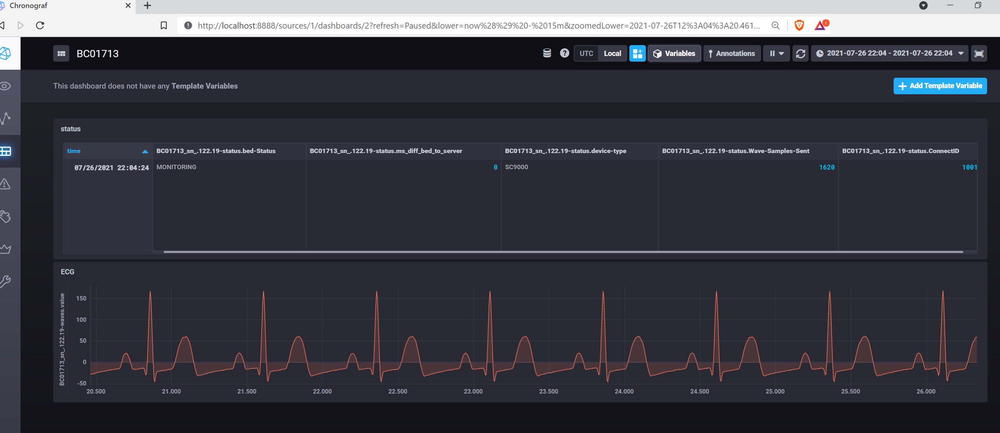

# Winaccess2influx Data research tool

Winaccess2influx is a research tool for capturing vital signs data from Draeger Infinity Gateway API interface and exporting to influxdb time series database.
This tool is not validated for clinical diagnostic purposes
The tool generates API calls to vendor supplied WvApi.dll, and exports data to influxDB time series database.

# Quick Start
* Download influxDB 1.8x and chronograf from https://portal.influxdata.com/downloads/
* Requires dedicated Infinity Gateway with Winaccess API
* Copy Infinity Gateway API DLL files (IGAcsMsg.dll and WvAPI.dll) into the winaccess2influx install folder
* Run influxd and chronograf. Open browser to  http://localhost:8888 , create databases and set retention period. 
* The default database names are waves, trends and status
* Run winaccess2influx.exe, this will create a default config file in [user-Home]/.winaccess2influx/winaccess.cfg

## Build instructions 
Windows only due to vendor supplied DLL, building in Visual Studio 2022 c++ 17
Boost and influxdb dependencies can be installed with vcpkg. The vcpkg influxdb-cxx package comes from https://github.com/offa/influxdb-cxx.
Add custom compile flag to avoid boost log error "-DBOOST_USE_WINAPI_VERSION=BOOST_WINAPI_VERSION_WIN7"

```
c:\vcpkg>vcpkg install influxdb-cxx boost-assign  boost-filesystem boost-tokenizer boost-log boost-algorithm boost-date-time
c:\vcpkg>vcpkg integrate install

```

The influxdb-cxx package was modified to use milliseconds rather than nanoseconds. Followed example of vcpkg patching here https://github.com/microsoft/vcpkg/blob/master/docs/examples/patching.md

```
diff --git a/LineProtocol.cxx b/LineProtocol.cxx
index f74b688..6a1570e 100644
--- a/LineProtocol.cxx
+++ b/LineProtocol.cxx
@@ -52,6 +52,6 @@ namespace influxdb
         appendIfNotEmpty(line, point.getFields(), ' ');
 
         return line.append(" ")
-            .append(std::to_string(std::chrono::duration_cast<std::chrono::nanoseconds>(point.getTimestamp().time_since_epoch()).count()));
+            .append(std::to_string(std::chrono::duration_cast<std::chrono::milliseconds>(point.getTimestamp().time_since_epoch()).count()));
     }
 }
```



